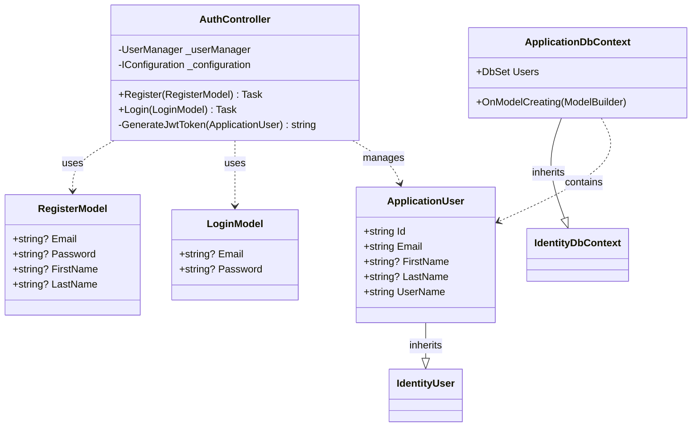
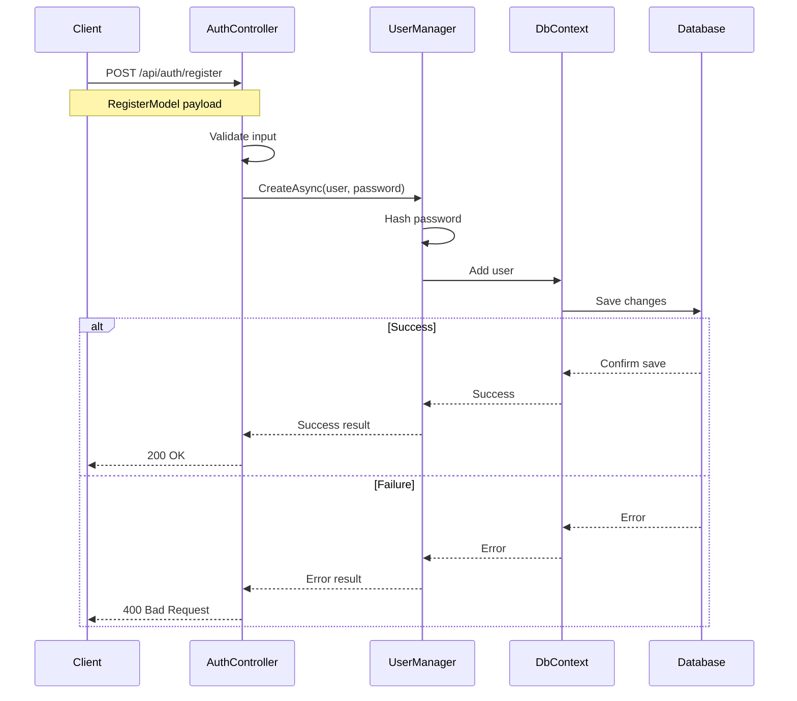
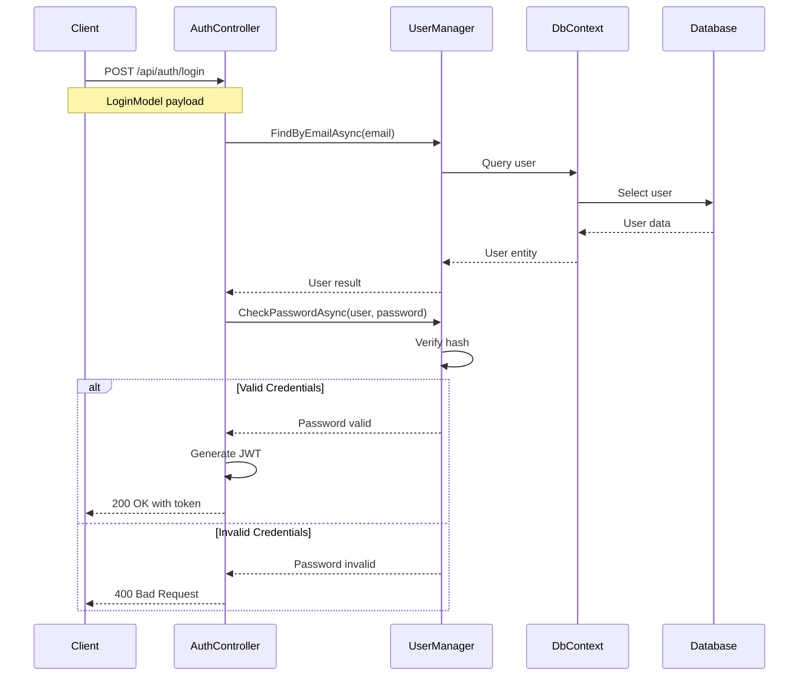
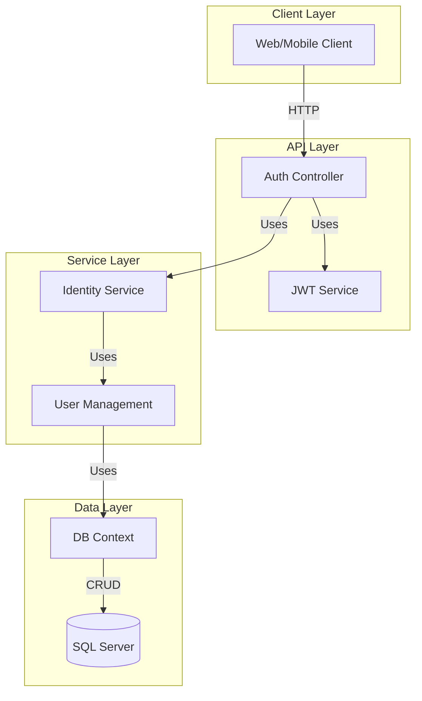
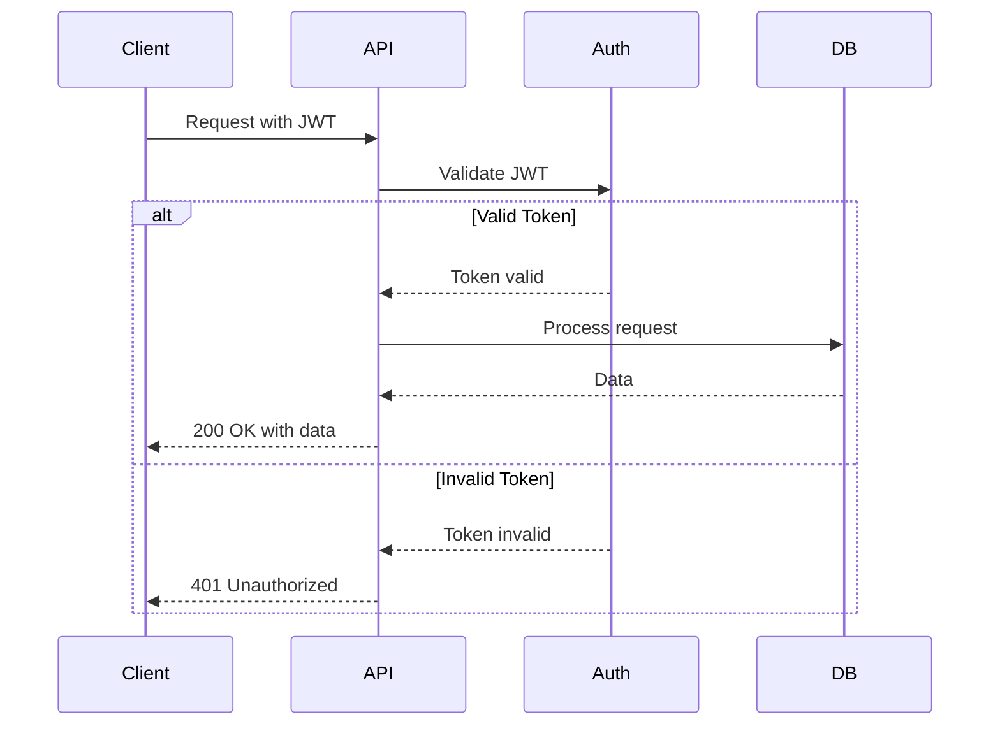

# System Architecture

This document provides UML diagrams illustrating the system's architecture and interactions.

## Class Diagram

## Sequence Diagrams

### User Registration Flow

### User Login Flow

## Component Diagram

## Security Flow

## System Interactions

The authentication system follows these key interaction patterns:

1. **Registration Flow**:
   - Client sends registration data
   - System validates input
   - Password is hashed
   - User data is stored
   - Success/failure response returned

2. **Login Flow**:
   - Client sends credentials
   - System verifies user exists
   - Password is verified
   - JWT token generated
   - Token returned to client

3. **Authentication Flow**:
   - Client includes JWT in requests
   - System validates token
   - Access granted/denied based on validation

4. **Data Security**:
   - Passwords are hashed using Identity framework
   - JWTs are signed with private key
   - Database access is controlled via Entity Framework
   - HTTPS ensures transport security

The diagrams above illustrate these interactions in detail, showing how different components of the system work together to provide secure authentication functionality.
